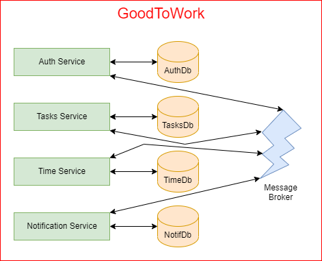
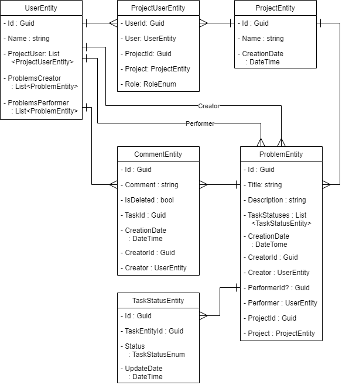
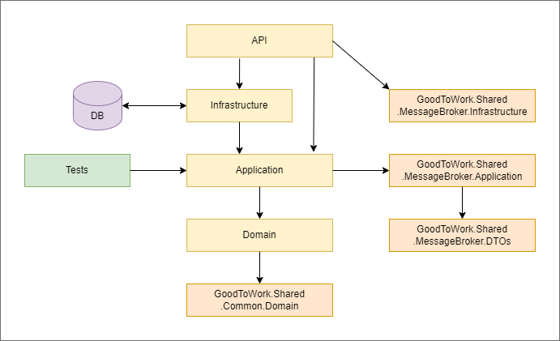

# Good To Work  

GoodToWork is application microservices based application still developed. My main motive which forced me to create it is to develop one product based on new skills I've learnt connected with microservice architecture, event bus (rabbitMQ), clean architecture, MediatR, MongoDB, Dapper and design patterns.  
  
### Application diagram:  
  
  
  
At this moment Tasks and Notification services are partially done.   
  
## Tasks Organizer   
Tasks organizer service is based on clean architecture. Application   
  
### Responsibility  
* create workspaces  
* create task and assign it to performer  
* changing task status  
* add comments to tasks  
  
### Diagram  
  
  
### Project Structure  
  
  
### Tech stack  
* MediatR  
* EF Core  
* xUnit  
* Moq  
  
## Notification Service  
  
### Responsibility  
* collects emails to send (using event bus)  
* send emails  
  
## Message Broker  
Message broker is shared tool which can be easily inject into any other project. It deliver easy API.  
Message broker tool has to:  
* create event  
* read event  
  
In this case it's implemented with RabbitMQ approach.